## 任务系统

### 前置说明

1. 日常任务：每天 00:00 刷新，玩家可以获取到宠物养成、装备打造、商店消费所需的道具及货币。
2. 剧情任务：主要起**玩法引导**功能。
3. 兑换任务：部分珍贵道具的兑换，及道具打包。
4. 宠物专属任务：获取威望，宠物专属装备。

### 日常任务（必刷）

1. **【日常】好事成双**系列任务可以获取大量修炼秘籍，宠物合成、宠物进化、宠物涅磐道具以及大量金币及威望。
2. **【日常】野外狩猎**系列任务可以获取水晶奖励，水晶可以用于神秘商店的消费。
3. **【日常】探索新大陆**系列任务可以获取较为珍贵的经验增益道具、宠物养成道具、装备精炼，装备强化道具。

## 野外探险

### 副本（必刷）

1. 一共有7个副本，**玩家每天可以通关各个副本一次，副本刷新时间为每天 00:00 。各个副本的难度，特殊掉落奖励如下（每个副本都产出大量的宠物养成道具、装备精炼道具、金币、威望，水晶...）**

   | 副本名称     | 难度  | 特殊掉落奖励                                                 |
   | ------------ | ----- | ------------------------------------------------------------ |
   | 伊苏王的神墓 | ☆     | 伊苏王装备套装图纸，粉钻水晶卡                               |
   | 火龙王的宫殿 | ☆☆    | 火龙王装备套装图纸、紫钻水晶卡，1~4星龙珠                    |
   | 史芬克斯密穴 | ☆☆☆   | 法老王装备套装图纸、粉钻水晶卡，紫钻水晶卡                   |
   | 玲珑城       | ☆☆☆☆☆ | 玲珑装备套装图纸、粉钻水晶卡、紫钻水晶卡、凤凰珠，雪羽宝鉴   |
   | 厄菲斯深渊   | ★☆☆☆☆ | 厄菲斯装备套装图纸、黄钻水晶卡，厄菲斯小礼包                 |
   | 阿尔提密林   | ★★☆☆☆ | 阿尔提装备套装图纸、粉钻水晶卡、黄钻水晶卡，阿尔提礼包       |
   | 菲拉苛地域   | ★★★☆☆ | 五系魂魄碎片、粉钻水晶卡、紫钻水晶卡、荣耀水晶卡，菲拉苛礼包 |

2. 玩家可以通过神秘商店使用水晶购买各个副本的通行证，使用后可以增加当天对应副本挑战次数(+1)。
3. 对于副本掉落装备套装图纸所需的精炼宝石，天界的精髓,装备强化龙珠，可以在铁匠铺消耗威望购买。

### 普通地图

1. 玩家可以在具体地图入口的 **地图介绍** 看到该地图的物品掉落详情（包括日常任务所需材料、宠物养成道具，部分对应宠物进化所需道具、部分地图装备套装...）。

   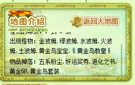

2. 地图难度为新大陆地图 > 旧大陆地图。且越高难度的地图掉落的奖励越丰富。新大陆地图掉落的更多为宠物涅磐所需道具，旧大陆掉落的更多为宠物进化合成道具。

### 特殊地图 - 圣兽云殿

1. 圣兽云殿的神宠怪物可以通过**圣兽云殿·精灵球**捕捉，该精灵球可以在道具商店消耗威望购买。
2. 圣兽云殿掉落的**天界的精髓**几率较高，但同样的挂机难度也高，玩家需要自行搭配生命值+伤害抵消装备来实现有效的挂机。

## 宠物等级

1. 经验增益道具使用有**等级限制**

   | 道具名                       | 使用等级限制 |
   | ---------------------------- | ------------ |
   | 修炼秘籍                     | 0 级         |
   | 200w 经验月饼、500w 经验月饼 | 30 级        |
   | 修炼仙册                     | 45 级        |
   | 十亿经验卷轴                 | 80 级        |

2. 宠物合成，宠物涅槃，宠物满等级**所需总体经验**

   | 对应等级                 | 大致需要经验 |
   | ------------------------ | ------------ |
   | 40（宠物神殿-宠物合成）  | 564 w        |
   | 60（宠物神殿-宠物涅磐）  | 900 w        |
   | 100 （宠物满级所需经验） | 56 E 4085 w  |

## 宠物装备

### 宠物资料：装备显示界面

1. 宠物面板上，**只有穿戴了具体部位装备的宠物才会显示对应的装备格子。不穿戴装备则不显示任何装备格子。**  
   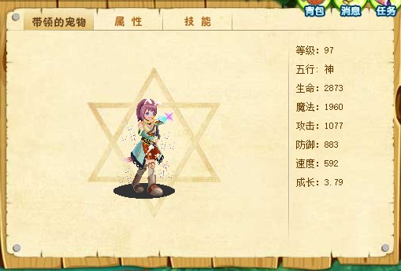  
   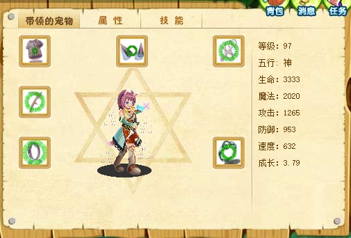    
2. **单个宠物最多携带 10 件装备，移除了装备卡片的设定。**  
   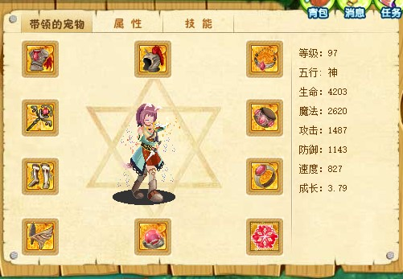 

### 装备及套装的高阶效果生效方式

**装备及套装的高阶效果(伤害加深、伤害抵消、生命偷取、魔法偷取、生命恢复)只对宠物携带的技能生效，且该宠物技能必须有对应的基础高阶效果。**

### 装备强化效果加成数值

1. 装备强化最高等级为**10 级**，具体**每级强化加成**如下。

   | 每级强化加成 | 攻击力 | 防御力 | 生命值 | 魔法值 | 速度值 |
   | ------------ | ------ | ------ | ------ | ------ | ------ |
   | %            | 8      | 6      | 30     | 12     | 3      |

### 装备自选包的兑换及装备碎片的获取

1. 装备碎片的获取方式：铁匠铺 -> 装备分解

   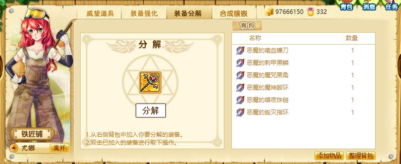

   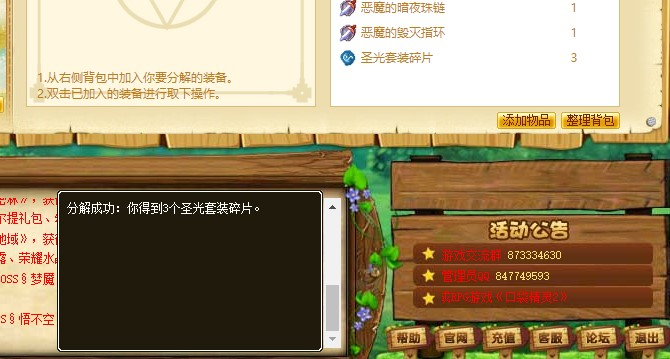

2. 装备自选包的兑换：任务系统 -> 兑换任务

   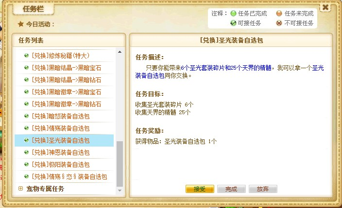

   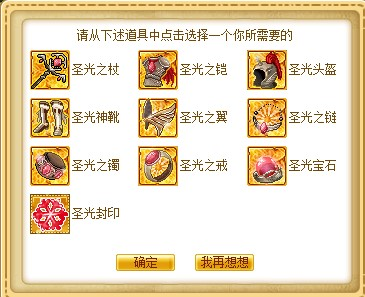

## 宠物合成

### 前置说明

1. **移除原游戏部分宠物合成公式，新增部分宠物合成公式**。出发点是游戏逻辑的合理性，**该版本所支持的特殊宠物合成公式如下所示。（以下公式均为随机性公式，添加至尊神石 100%出现。）**

### 特殊公式

| 宠物 A     | 宠物 B    | 合成最终宠物 |
| ---------- | --------- | ------------ |
| 鬼精灵欧姆 | 10 阶宠物 | 旋花妖王     |

### 常规五系宠物公式

**（获取无法直接进化而成的五系宠物，部分神系宠物）：**

| 宠物 A     | 宠物 B    | 合成最终宠物 |
| ---------- | --------- | ------------ |
|            |           |              |
| **金系**   |           |              |
|            |           |              |
| 黄金独角兽 | 7 阶宠物  | 黄金鸟       |
| 圣洁独角兽 | 8 阶宠物  | 黄金鸟教皇   |
| 圣羽天马   | 9 阶宠物  | 紫貘         |
| 兽王神     | 金系宠物  | 金 ★ 阿莲娜  |
| 兽王神     | 10 阶宠物 | 白虎         |
| 金龙霸王   | 金系宠物  | 金 ★ 阿莲娜  |
| 金龙霸王   | 10 阶宠物 | 小神龙琅琊   |
|            |           |              |
| **木系**   |           |              |
|            |           |              |
| 紫冥蟾     | 7 阶宠物  | 紫木蝎       |
| 化蛇王     | 7 阶宠物  | 恶魔鸟       |
| 青龙兽     | 8 阶宠物  | 花叶童子     |
| 青蛟       | 9 阶宠物  | 梦魇         |
| 小青龙琅琅 | 9 阶宠物  | 贪食蛇       |
| 青龙琅琅   | 木系宠物  | 木 ★ 艾比    |
| 青龙琅琅   | 10 阶宠物 | 小神龙琅琊   |
|            |           |              |
| **水系**   |           |              |
|            |           |              |
| 冰露       | 7 阶宠物  | 艾薇儿       |
| 雪蝶兽     | 7 阶宠物  | 爱莉雅       |
| 飞羽龟     | 8 阶宠物  | 调皮的雪孩子 |
| 梦幻猫     | 9 阶宠物  | 雪精灵       |
| 圣诞冰波姆 | 9 阶宠物  | 圣诞麋鹿     |
| 天使波姆   | 水系宠物  | 水 ★ 佑碧    |
| 天使波姆   | 10 阶宠物 | 冰雪鸟       |
| 冰龙苍海   | 水系宠物  | 水 ★ 佑碧    |
| 冰龙苍海   | 10 阶宠物 | 小神龙琅琊   |
|            |           |              |
| **火系**   |           |              |
|            |           |              |
| 火焰蝙蝠   | 8 阶宠物  | 猞猁猫       |
| 狐仙莫莫   | 9 阶宠物  | 火灵猴       |
| 六尾灵狐   | 火系宠物  | 火 ★ 西西    |
| 六尾灵狐   | 10 阶宠物 | 天狐莫姬     |
| 炎龙血焰   | 火系宠物  | 火 ★ 西西    |
| 炎龙血焰   | 10 阶宠物 | 小神龙琅琊   |
|            |           |              |
| **土系**   |           |              |
|            |           |              |
| 蚂蚁守卫   | 7 阶宠物  | 恶魔波姆     |
| 水晶圣甲虫 | 7 阶宠物  | 香蕉猴       |
| 岩兽人     | 8 阶宠物  | 月亮兔       |
| 战神兔     | 9 阶宠物  | 仙宫玉兔     |
| 天蚁宝宝   | 土系宠物  | 土 ★ 巴特    |
| 黄龙莫虚   | 土系宠物  | 土 ★ 巴特    |
| 黄龙莫虚   | 10 阶宠物 | 小神龙琅琊   |

### 海底世界公式

| 宠物 A | 宠物 B | 合成最终宠物 |
| ------ | ------ | ------------ |
| 金鱼   | 海马   | 小玄武       |
| 海马   | 金鱼   | 小玄武       |
| 小玄武 | 五系龙 | 龙蛇玄武     |

### 新大陆合成公式

| 宠物A                          | 宠物B                      | 合成最终宠物 |
| ------------------------------ | -------------------------- | ------------ |
| 鸭子/小狸猫/飞天猪             | 黄金独角兽/化蛇王/雪蝶兽   | 石阵巨人     |
| 狂怒鹰/单车狮子王/无辜小鹿     | 火羽/水晶圣甲虫/圣洁独角兽 | K歌仙人掌    |
| 毒喃鼠/鸭嘴龟/慕斯幽           | 青龙兽/飞羽龟/火焰蝙蝠     | 暗夜咻豹     |
| 福尔摩狮/女法师琳达/偷桃的小猴 | 岩兽人/圣羽天马/青蛟       | 悟不空       |
| 僵尸叔叔/正太木乃伊/魔法女生   | 梦幻猫/狐仙莫莫/战神兔     | 千年老妖     |
| 丘比特/木马骑士/唱片机小兔     | 梦幻猫/狐仙莫莫/战神兔     | 飞碟宝宝     |
| 天使妖妖                       | 天使妖妖/念道天使          | 双翼天使妖妖 |
| 念道天使                       | 天使妖妖/念道天使          | 圣天使妖妖   |
| 地狱火魔兽/腐蚀鸟              | 地狱火魔兽/腐蚀鸟          | 深渊魔童     |

## 宠物涅磐

### 前置说明

1. **移除原游戏部分宠物涅磐公式，新增部分宠物涅磐公式**。出发点是游戏逻辑的合理性，**以下公式均为100%。）**

### 特殊神宠

| 宠物A      | 宠物B      | 涅磐最终宠物 |
| ---------- | ---------- | ------------ |
| 兔啦花花   | 睡美人雅雅 | 兔儿啾啾     |
| 睡美人雅雅 | 兔啦花花   | 兔儿啾啾     |

### 常规神宠

| 宠物A      | 宠物B      | 涅磐最终神宠 |
| ---------- | ---------- | ------------ |
| 小神龙琅琊 | 小神龙琅琊 | ★青龙★       |
| 小神龙琅琊 | 木★艾比    | 狻猊         |
| 小神龙琅琊 | 土★巴特    | 剑蛇君       |
| ★青龙★     | 影兽       | 青影龙       |
|            |            |              |
| 白虎       | 白虎       | ★破天虎★     |
| 白虎       | 金★阿莲娜  | 许德拉       |
| ★破天虎★   | 虎妞       | 圣破天       |
|            |            |              |
| 冰雪鸟     | 水★佑碧    | 齐伦         |
| 天狐莫姬   | 火★西西    | 艾尔斯       |

### 海底世界

| 宠物A    | 宠物B                                     | 涅磐最终神宠 |
| -------- | ----------------------------------------- | ------------ |
| 龙蛇玄武 | 金★阿莲娜/木★艾比/水★佑碧/火★西西/土★巴特 | ★穷奇★       |

### 熊猫相关公式

| 宠物A      | 宠物B     | 涅磐最终神宠 |
| ---------- | --------- | ------------ |
| 熊猫orz-烈 | 金★阿莲娜 | 熊猫爆虚     |
| 熊猫orz-烈 | 木★艾比   | 熊猫竹君     |
| 熊猫orz-烈 | 水★佑碧   | 熊猫天驹     |
| 熊猫orz-烈 | 火★西西   | 熊猫帝铯     |
| 熊猫orz-烈 | 土★巴特   | 熊猫伞仙     |

### 天之路

| 宠物A        | 宠物B        | 涅磐最终神宠 |
| ------------ | ------------ | ------------ |
| 圣天使妖妖   | 圣天使妖妖   | 执法天使     |
| 双翼天使妖妖 | 双翼天使妖妖 | 执法天使     |
| 圣天使妖妖   | 双翼天使妖妖 | 伪暗天使     |
| 双翼天使妖妖 | 圣天使妖妖   | 伪暗天使     |

### 危之路

| 宠物A  | 宠物B  | 涅磐最终神宠 |
| ------ | ------ | ------------ |
| 白无常 | 白无常 | 黑无常       |
| 黑无常 | 黑无常 | 白无常       |

## 神宠进化

### 前置说明

1. 部分神宠的获取需要依靠基础神宠+对应进化道具（威望商店购买或礼包开启）来获取。

2. 进化场景为宠物神殿 -> 神宠进化。

   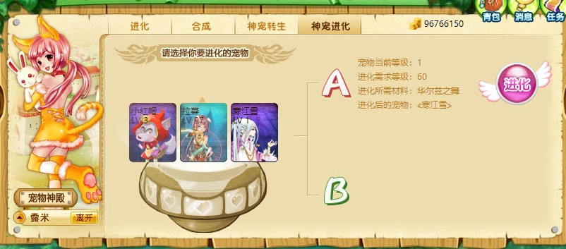

### 神宠进化路线及所需进化道具

| 基础宠物          | 所需进化道具  | 进化而成的宠物    |
| ----------------- | ------------- | ----------------- |
| 机械兽            | 幽蜚晶章      | 幽蜚              |
| 幽蜚              | 幽蜚-R-01晶章 | 幽蜚-R-01         |
| 熊猫orz宝宝       | 熊猫的竹笋    | 熊猫orz-烈        |
| 格斗宝宝          | 格斗晶章      | 格斗王子          |
| 邪灵宝宝          | 邪灵晶章      | 恶魔邪灵          |
| 暗翼君主-初级     | 暗翼结晶      | 暗翼君主-中级     |
| 暗翼君主-中级     | 暗翼晶章      | 暗翼君主          |
| 执法天使/伪暗天使 | 天使晶章      | 炽天使            |
| 狂战神宝宝        | 狂魔珠        | 幻·狂战神         |
| 狂战神宝宝        | 魔神珠        | 斧·狂战神         |
| 年兽宝宝          | 年兽的胡萝卜  | 年兽              |
| 寒江雪宝宝        | 江雪晶章      | 寒江雪            |
| 寒江雪            | 华尔兹之舞    | ≮寒江雪≯          |
| 阳阳              | 光明之泪      | 瓦尔达/阿吉达     |
| 瓦尔达/阿吉达     | 神圣祝福      | 科菲/拉暮         |
| 淘淘              | 光明之泪      | 吉安娜/库库尔     |
| 吉安娜/库库尔     | 神圣祝福      | 桃乐丝/爱莉丝     |
| 眠眠              | 光明之泪      | 小白艾艾/艾斯菲尔 |
| 小白艾艾/艾斯菲尔 | 神圣祝福      | 巴巴菲尔/巴巴莉尔 |

## 解决设备切换时，账号数据同步的方法

1. 该游戏为单机游戏， **此处的单机指的是玩家数据存储在玩家本地，服务器不存储任何玩家数据。** 账号登录、宠物图片、字体等资源加载还是依赖网络连接的。

2. **由于上述原因，玩家从一个浏览器切换到另外一个浏览器，或是从PC端切换到移动端。若要实现账号数据同步。则需要执行以下操作**：
   
   1. 旧浏览器登录账号，打开个人信息，点击上传数据。
   
      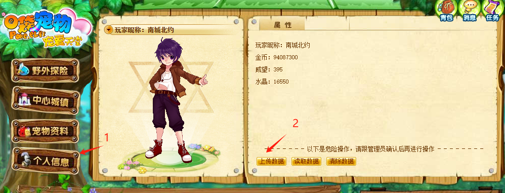
   
      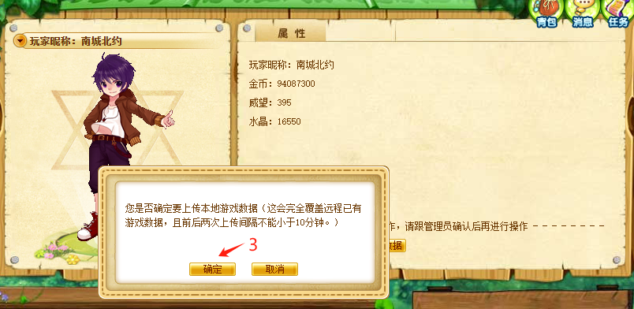
   
   2. 在新设备或者新浏览器上，打开个人信息，读取数据。
   
      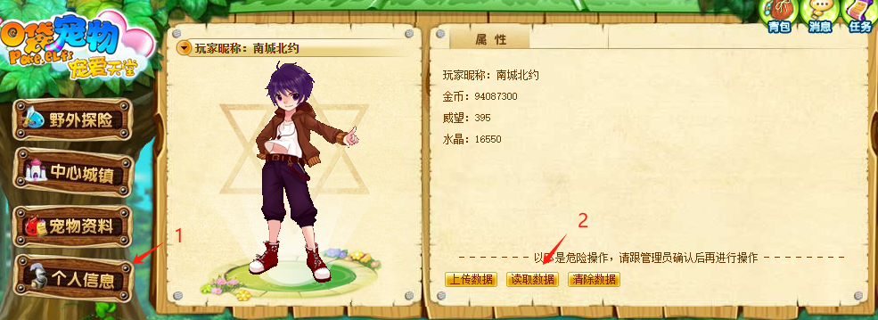
   
      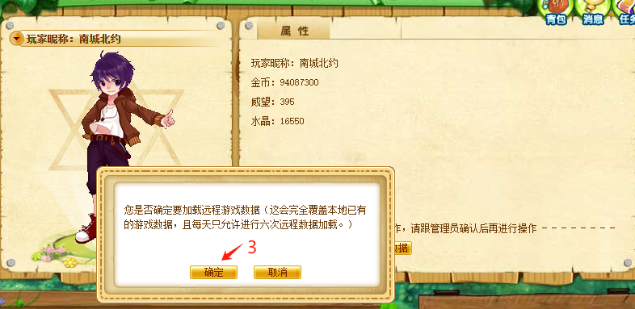

## 解决游戏PC端无法挂机|挂机卡顿的方法汇总

### Edge 浏览器

1. 在地址栏输入 **edge://settings/system** 跳转到浏览器设置界面

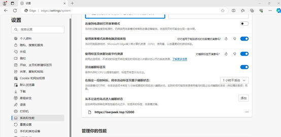

2. 选中左侧列表中的**系统与性能**,再找到右侧的**从不让这些站点进入睡眠模式**，**添加游戏网址：https://laerpeek.top:12000**

### 谷歌Chrome 浏览器

1. 在地址栏输入 **chrome://settings/performance** 跳转到浏览器设置界面

   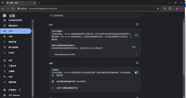

2. 选中左侧列表中的**性能**,再找到右侧的**始终让这些网站保持活动状态**，**添加游戏网址：https://laerpeek.top:12000**

## 移动端挂机方式

### 微信浏览器

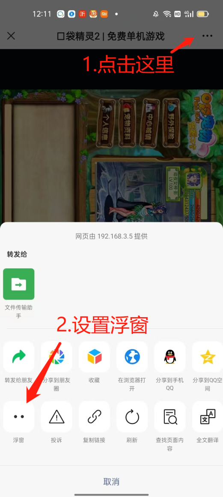

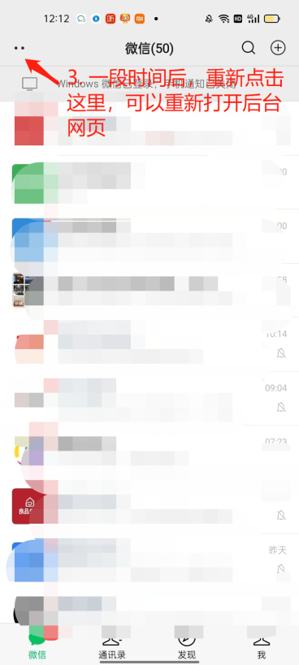

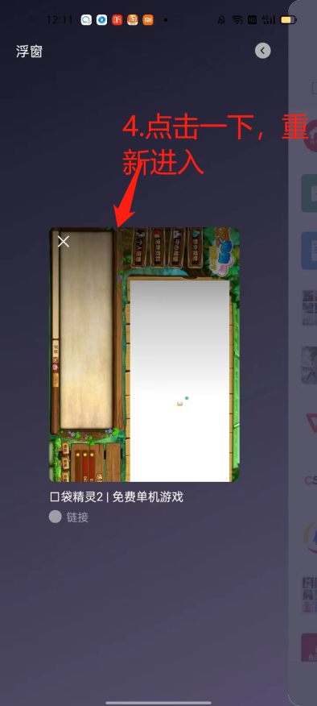
